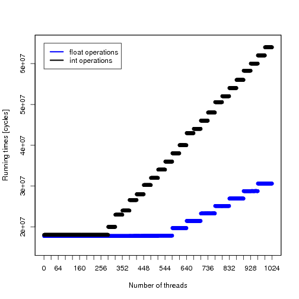

% Design of a Novel Many-Core Crypto Processor

Clément Humbert, Tristan Overney

November 21st, 2014

# Summary

* Goal of the project
* Cryptography on GPU
* First approach
* Microbenchmarking
* The future


# Goal of the project

Find a way to increase GPU performance for cryptographic applications.

# Cryptography on GPU // c'est p-ê trop proche de la slide précédente mais je ne vois pas comment séparer mieux!

* High level of parallelism, ideal for cryptographic algorithms.
* But GPU’s principal focus are single-precision floating-point number operations.
* Nividia’s Fermi is the most recent architecture with decent integer number operation.
* Lack of large multipliers for integers

# First approach

* First approach was to build hardware components
    * Montgomery multiplier
    * Larger multiplier
* And mimic the Fermi's architecture
* We tinkered on a simulator (gpgpu sim) to be able to test custom opcodes

There was just too much things we didn’t know about Fermi.

# Microbenchmarking

* We need to have a better understanding of the Fermi architecture
* Fermi is closed and there is little to no precise informations about its microarchitecture
* We had a Fermi card ready for some live measurement

# Benchmarking cuda cores

* Are floating points and int ALUs really present at a 1:1 ratio ?
* How could the inferior integer performances be explained if yes ?
* How is the scheduling performed ? 

# Benchmark programs

``` cpp
for(int i = 0; i < n; i++) {
    asm volatile("mul.lo.u32 %0, %0, %1;" : "+r"(op_a) : "r"(op_b));
    asm volatile("mul.lo.u32 %0, %0, %1;" : "+r"(op_a) : "r"(op_b));
    /* ... */ 
    asm volatile("mul.lo.u32 %0, %0, %1;" : "+r"(op_a) : "r"(op_b));
}
```

# Integer vs. Single-precision floating-points

* Running a million of operations
    * Once for integer multiplication
    * Once for sp-fp multiplication

* Expecting slightly lower performances for integer

# Integer vs. Single-precision floating-points (2)
<div style="text-align: center; margin-top: 120px">

</div>

# Scheduling, first hypothesis

* Only half of the cores have integer ALUs
* No dependency check, confirmed by Nvidia's whitepaper on Fermi

# Scheduling, first hypothesis (2)
<div style="text-align: center; margin-top: 120px">

</div>

# Integer vs. Single-precision floating-points (2)
<div style="text-align: center; margin-top: 120px">

</div>

# Second scheduling hypothesis
<div style="text-align: center; margin-top: 120px">

</div>

# What's next
* Determine what can be removed from a Fermi card for our purpose
* Hardware implementation of specific algorithms in less than 16 cycles
* Simulation of changes using a modified version of gpgpu-sim

