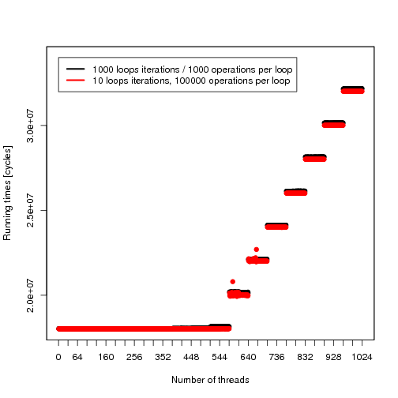
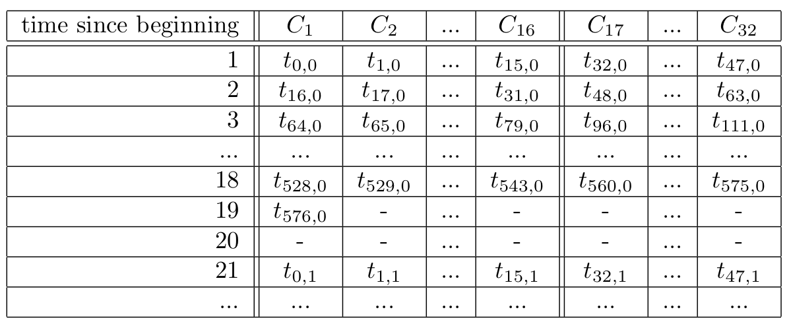

% Design of a Novel Many-Core Crypto Processor

Clément Humbert, Tristan Overney

November 21st, 2014

# Summary

* Goal of the project
* Cryptography on GPU
* First approach
* Microbenchmarking
* Fermi
* Microbenchmarking results
* What's next 


# Goal of the project

* Increase GPU performance for cryptographic applications.
  * Understanding current limitations of cryptography on GPUs
  * Understanding the microarchitecture of currently used GPUs
  * Find a way to change this architecture to improve performances of cryptographic applications

# Cryptography on GPU // c'est p-ê trop proche de la slide précédente mais je ne vois pas comment séparer mieux!

<h3> Pro </h3>

* High level of parallelism, ideal for cryptographic algorithms.

<h3> Cons</h3>

* Focused on single-precision floating-point operations.
* Lack of large multipliers for integers.

<h2>Why Nvidia & Fermi architecture</h2>

* Nividia's GPU are build around CUDA core.
* Fermi is their most recent architecture with decent integer multiplication throughput.

# First approach

* First approach was to build hardware components
  * Montgomery multiplier
  * Larger multiplier
* And mimic the Fermi's architecture
* We tinkered on a simulator (gpgpu sim) to be able to test custom opcodes

There was just too much things we didn’t know about Fermi.

# Microbenchmarking

* We need to have a better understanding of the Fermi architecture
* Fermi is closed and there is little to no precise informations about its microarchitecture
* We had a Fermi card ready for some live measurement

# Fermi's Streaming Multiprocessor

<div style="text-align: center; margin-top: 10px; font-size:14pt">

<br/>
http://en.wikipedia.org/wiki/Fermi_(microarchitecture)#mediaviewer/File:Fermi.svg
</div>

# CUDA Core

<div style="text-align: center; margin-top: 80px; font-size:14pt">

<br/>
http://www.nvidia.com/content/pdf/fermi_white_papers/nvidiafermicomputearchitecturewhitepaper.pdf
</div>

# Blocks, warps, scheduling

* The block size is the number of threads that will run a kernel
* A warp consists of 32 threads
* Each scheduling cycle, a half of two different warps are scheduled

# Benchmarking cuda cores

* Are (single-precision) floating-point and integer units really present in each core ?
* How can the inferior integer operations throughput compared to floating-points be explained ?
<div style="text-align: center; margin-top: 10px; font-size:11pt">

<br/>
http://docs.nvidia.com/cuda/cuda-c-programming-guide/index.html#arithmetic-instructions__throughput-native-arithmetic-instructions
</div>
* How is the scheduling performed ? 

# Integer vs. Floating-points

* Running a million of operations
* Once for integer multiplication
* Once for floating point multiplication
* Expecting lower performances for integer

# Benchmark programs

```rust
for(int i = 0; i < n; i++) {
    asm volatile("mul.lo.u32 %0, %0, %1;" : "+r"(op_a) : "r"(op_b));
    asm volatile("mul.lo.u32 %0, %0, %1;" : "+r"(op_a) : "r"(op_b));
    /* ... */ 
    asm volatile("mul.lo.u32 %0, %0, %1;" : "+r"(op_a) : "r"(op_b));
}
```

```rust
for(int i = 0; i < n; i++) {
    a = a * b; 
    a = a * b; 
    /* ... */ 
    a = a * b; 
}
```

# Integer vs. Single-precision floating-points (2)
<div style="text-align: center; margin-top: 60px">

</div>

# Scheduling, first hypothesis

* 18 stages pipeline
* Only half of the cores have integer ALUs
* Need to check the for-loop cost to validate

# For loop cost
<div style="text-align: center; margin-top: 40px">

</div>

# Scheduling, first hypothesis (2)
<div style="text-align: center; margin-top: 60px">

</div>

# Semi-dependencies benchmark program

```rust
for(int i = 0; i < n; i++) {
    asm volatile("mul.lo.u32 %0, %0, %1;" : "+r"(op_a) : "r"(op_b));
    asm volatile("mul.lo.u32 %0, %0, %1;" : "+r"(op_c) : "r"(op_d));
    asm volatile("mul.lo.u32 %0, %0, %1;" : "+r"(op_a) : "r"(op_b));
    asm volatile("mul.lo.u32 %0, %0, %1;" : "+r"(op_c) : "r"(op_d));
    /* ... */ 
    asm volatile("mul.lo.u32 %0, %0, %1;" : "+r"(op_a) : "r"(op_b));
    asm volatile("mul.lo.u32 %0, %0, %1;" : "+r"(op_c) : "r"(op_d));
}
```

```rust
for(int i = 0; i < n; i++) {
    a = a * b;
    c = c * d; 
    a = a * b;
    c = c * d; 
    /* ... */ 
    a = a * b;
    c = c * d; 
}
```

# Dependence vs. Semi-dependence
<div style="text-align: center; margin-top: 60px">

</div>

# Second scheduling hypothesis
<div style="text-align: center; margin-top: 60px">

</div>

# Conclusions

* We can gain space by removed/replacing SFUs
* Only 16 cores have integer multiplication capabilities, so 16 can be replaced
* New components don't need to be optimized in term of latency (up to 18 cycles)

# What's next

* Determine what can be removed from a Fermi card for our purpose
* Hardware implementation of specific algorithms in less than 16 cycles
* Simulation of changes using a modified version of gpgpu-sim

# Questions

<div style="text-align: center; margin-top: 60px; font-size:10pt">

http://inotternews.com/wp-content/uploads/2013/09/190_1jeross_pb02_29.jpg
</div>
